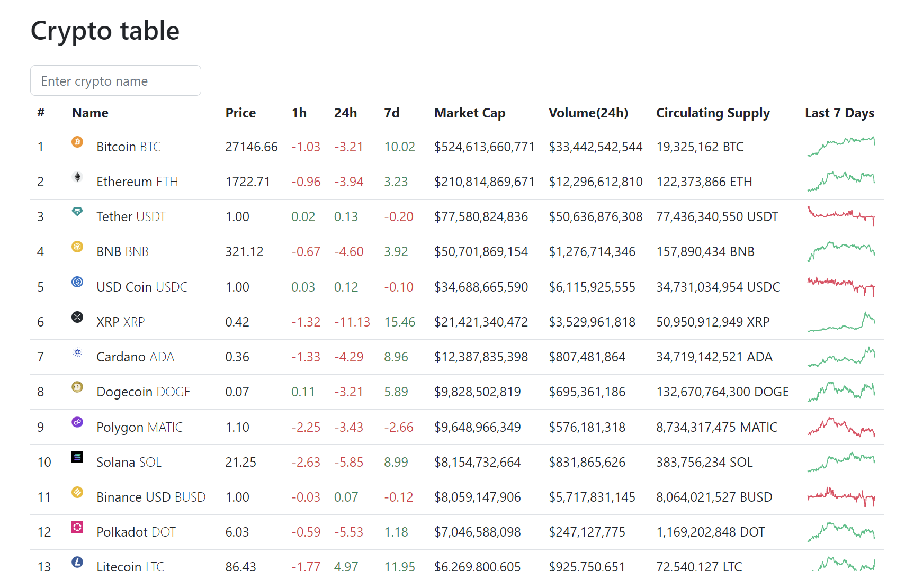

# Laravel Crypto App

----------

# Getting started

## Installation

Please check the official laravel 10 installation guide for server requirements before you start. [Official Documentation](https://laravel.com/docs/10.x/installation)

Alternative installation is possible without local dependencies relying on [Docker](#docker). 

Clone the repository

    git clone https://github.com/arvydux/crypto.git

Switch to the repo folder

    cd crypto

Install all the dependencies using composer

    composer install

Copy the example env file and make the required configuration changes in the .env file

    cp .env.example .env

In the .env file set your **CoinMarketCap**’s your API access key to CRYPTO_API_KEY parameter

    CRYPTO_API_KEY=<YOUR API ACCESS KEY>

Install all the dependencies using npm

    npm install
    
Run bundler to build Asset Files

    npm run dev    

Run the database migrations

    php artisan migrate
    
Create a symbolic link    

    php artisan storage:link

Start the local development server

    php artisan serve

You can now access the server at http://localhost:8000

## Database filling with data from  API request

Execute Artisan command to fill "crypto" table with data.

    php artisan crypto:get-data
